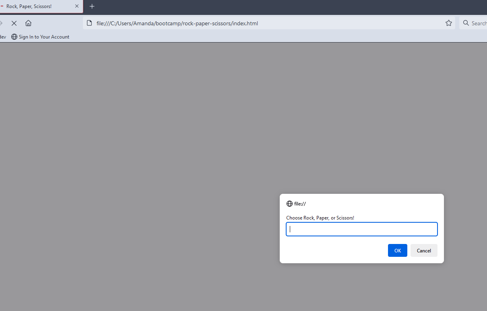

# Rock, Paper, Scissors

## Description

A simple rock, paper, scissors game in the browser using javascript. I used Math.floor and Math.random to randomize the computer's selection and then get the user's choice from a prompt(). The program then compares the two and shows the results. After that, it displays a confirm() message asking if the user would like to play again and showing a tally of wins, losses, and ties.

## Installation

N/A

## Usage
Simply open index.html in the browser to play the game or view the code in the GitHub repo.